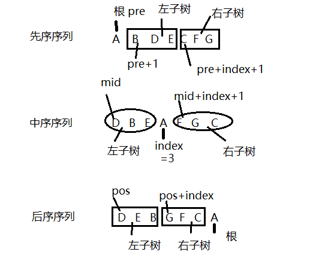

# 二叉树

## 特点

* 有且仅有一个称为根的结点
* 除了结点以外,其余结点分为两个互不相交的子集`T1`和`T2`,分别称为T的左子树和右子树,且`T1`和`T2`本身都是二叉树

## 性质

* 二叉树的第i层最多有`2^(i-1)`个结点
* 深度为K的二叉树最多有`2^k-1`个结点
* 二叉树结点数为`n`,分支数为`e`,则`n=e+1`,度为1的结点数`n1`,度为2的结点数`n2`,则`e=n1+2n2`
* 对于任何一棵二叉树,若叶子数为`n0`,度为2的结点数为`n2`,则`n0=n2+1`
* **满二叉树**:一棵深度为k且有`2^k-1`个结点的二叉树
* **完全二叉树**:除了最后一层外,每一层都是满的,最后一层结点是从左向右出现的
* 具有n个结点的完全二叉树的深度必为`[log2n]+1`(不大于`log2n`的最大整数)
* 对于完全二叉树,若从上至下,从左至右编号,则编号为`i`的结点,其左孩子编号必为`2i`,其右孩子编号必为`2i+1`,其双亲的编号必为`i/2`

## 二叉树遍历

先序遍历:访问根,先序遍历左子树,左子树为空或已遍历才遍历右子树

中序遍历:先访问左子树,左子树为空或已遍历才访问根,然后才是右子树

后序遍历:先访问左子树,再访问右子树,最后访问根

层次遍历:同一层从左向右遍历,然后下一层

## 二叉树创建

补空法:

* 如果左子树或右子树为空时,则用特殊字符补空,然后按照先序遍历的顺序,得到先序遍历序列,根据该序列递归创建二叉树
  * 输入补空后的二叉树先序遍历序列
  * 如果ch='#',T=NULL;否则创建一个新结点,该结点的值位ch;递归创建T的左子树,递归创建T的右子树

[代码](code/tree00.cpp)


## 二叉树还原

* 先序的第一个字符(后序最后一个)为根
* 中序以根为中心划分左右子树
* 还原左右子树
* 左子树的长度等于`index`,右子树的长度等于`len-index-1`(`len`为有效长度)
* 关键是找先序序列或后序序列子树根的位置(B,C的位置)



```cpp
typedef struct Bnode //二叉树存储结构
{
    char data;
    struct Bnode *lchild;
    struct Bnode *rchild;
} Bnode, *Btree;
Btree pre_in_creatrtree(char *pre, char *mid, int len) //先序中序还原树
{
    if (len == 0)
        return nullptr;
    char ch = pre[0];
    int index = 0;
    while (mid[index] != ch)
        index++;
    Btree T = new Bnode();
    T->data = ch;
    T->lchild = pre_in_creatrtree(pre + 1, mid, index);
    T->rchild = pre_in_creatrtree(pre + index + 1, mid + index + 1, len - index - 1);
    return T;
}
Btree pos_in_creatrtree(char *pos, char *mid, int len) //后序中序还原树
{
    if (len == 0)
        return nullptr;
    char ch = pos[len - 1];
    int index = 0;
    while (mid[index] != ch)
        index++;
    Btree T = new Bnode();
    T->data = ch;
    T->lchild = pos_in_creatrtree(pos, mid, index);
    T->rchild = pos_in_creatrtree(pos + index, mid + index + 1, len - index - 1);
    return T;
}
```

[简单的遍历](code/tree01.cpp)

[根据先序和中序输出后序](code/tree02.cpp)

[根据后序和中序寻找最短叶子](code/tree03.cpp)

[两结点之间的距离](code/tree04.cpp)

# 哈夫曼树

哈夫曼编码的基本思想是以字符的使用频率作为权构建一棵哈夫曼树,然后利用哈夫曼树对字符进行编码

构造一棵哈夫曼树,是将所要编码的字符作为叶子结点,该字符在文件中的使用频率作为叶子结点的权值,以自底向上的方式,通过n-1此的"合并"运算后构造出的树,核心思想是让权值大的叶子离根最近

哈夫曼算法采取的贪心策略是每次从树的集合中取出没有双亲且权值最小的两棵树作为左右子树,构造一棵新树,新树根结点的权值为其左右孩子结点权值之和,将新树插入到树的集合中

哈夫曼树中没有度为1的结点,则一棵有n个叶子结点的哈夫曼树共有`2n-1`个结点(`n-1`次合并,每次产生一个新的结点)

构成哈夫曼树后,为求编码需从叶子结点出发走一条从叶子到根的路径

译码需要从根出发走一条从根到叶子的路径,那么对于每个结点而言,需要知道每个结点的权值,双亲,左孩子,右孩子和结点的信息

[哈夫曼编码](code/tree05.cpp)

