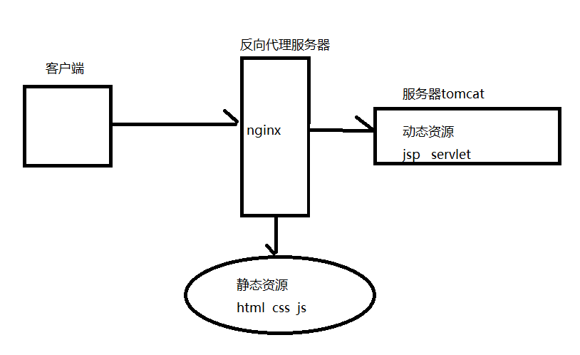

# 基本概念

`Nginx`是一个高性能的HTTP和反向代理服务器,其特点是占有内存少,并发能力强,专门为性能优化而开发,有报告表名能支持高达50000个并发连接数

## 反向代理

正向代理

* 如果把局域网外的`Internet`想象成一个巨大的资源库,则局域网中的客户端要访问`internet`,则需要通过代理服务器来访问,这种代理服务器就称为正向代理(浏览器配置代理服务器)

**反向代理**

* 客户端对代理是无感知的,无需任何配置,只需要将请求发送到反向代理服务器,由反向代理服务器去选择目标服务器获取数据后,再返回给客户端,此时反向代理服务器和目标服务器对外就是一个服务器,暴露的是代理服务器地址,隐藏了真实服务器`IP`地址

## 负载均衡

普通的请求响应

* 客户端发送请求到服务器,服务器与数据库交互,服务器处理完毕后,再将结果返回给客户端
* 并发请求相对较少的情况下是比较合适的,但如今信息数量,访问量,数据量飞速增长,系统业务复杂度增加,这种架构会造成服务器响应客户端的请求缓慢,当并发量特别大时,还容易造成服务器直接崩溃

**负载均衡**

* 当并发量较大时,我们可以增加服务器的数量,将请求分发到各个服务器上,将原先请求集中到单个服务器的情况改为请求分发到多个服务器上,将负载分发到不同的服务器上,就是负载均衡


## 动静分离

为了加快网站的解析速度,可以把动态页面和静态页面由不同的服务器来解析,加快解析速度,降低原来单个服务器的压力



# 命令与配置

## 常用命令

```nginx
#使用命令的前提条件,进入nginx目录
/usr/local/nginx/sbin
#查看版本号
./nginx -v
#启动nginx
./nginx
#关闭nginx
./nginx -s stop
#重加载配置文件
./nginx -s reload
```

## 配置文件

配置文件位置`/usr/local/nginx/conf/nginx.conf`

配置文件由三部分组成:全局块,`events`块,`http`块

全局块:

* 从配置文件开始到events块之间的内容,主要会设置一些影响nginx服务器整体运行的配置指令

```
worker_processes 1;  #nginx处理并发的数量
```

`events`块:

* `events`块涉及的指令主要影响`nginx`服务器与用户的网络连接

```
worker_connections 1024;	#支持最大连接数
```

`http`块

* `http`块又包含`http`全局块,`server`块,是`nginx`服务器配置最频繁的部分
* `http`全局块指令包含文件引入,MIME-TYPE定义,日志自定义,连接超时时间,但链接请求上限等
* `server`块:与虚拟主机有密切关系,虚拟主机从用户角度看,和一台独立的硬件主机是完全一样的,该技术的产生是为了节省互联网服务器硬件成本

```
listen	80;	#监听端口号
server_name	localhost;	#主机名
```

# 配置实例

## 反向代理1

实现效果

* 打开浏览器,再浏览器地址栏中输入地址,跳转到`linux`系统中tomcat主页面

准备工作

* 载`linux`安装tomcat,使用默认端口8080
* 进入tomcat的bin目录中,`./startup.sh`启动tomcat服务器
* 查看开放的端口号`firewall-cmd --list-all`
* 对方开放访问的端口`firewall-cmd --add-port=8080/tcp --permanent`
* 重启防火墙`firewall-cmd --reload`
* 在host文件中配置域名映射`ip`地址
* 

windows浏览器访问tomcat过程


在`Nginx`中进行请求转发的配置(反向代理配置)

* 在配置文件中修改server块中`server_name`为`ip`地址
* 将`location`中加上`proxy_pass http://127.0.0.1:8080;`
* 启动`nginx`

用windows浏览器测试

## 反向代理2

实现效果:使用反向代理,根据访问的路径跳转到不同端口的服务中

`nginx`监听端口为9001

访问`http://127.0.0.1:9001/edu1/`直接跳转到`127.0.0.1:8081`

访问`http://127.0.0.1:9001/edu2/`直接跳转到`127.0.0.1:8082`

准备工作:

* 准备两个tomcat服务器,一个是8081端口,一个是8082端口`conf/server.xml`修改

具体配置:

* 再加一个server块(或修改已存在的),修改`listen`和`server_name`

* 修改`location`

* ```
  location ~ /edu1/ {
  		proxy_pass http://localhost:8081;
  }
  location ~ /edu2/ {
  		proxy_pass http://localhost:8082;
  }
  ```

* 开放对外访问的端口号

## 负载均衡

现实效果:

* 通过浏览器访问某个页面实现负载均衡效果,将请求平均分配到8081和8082端口

准备工作:

* 准备两个tomcat服务器,一个是8081端口,一个是8082端口
* 在两个tomcat里面`webapps`目录中,创建名为`edu3`的文件夹,在文件夹中创建页面

在配置文件中进行负载均衡

* 在`http`块中添加一个`upstream 名字`
* 
* 在`sever`块中添加
* 
* 浏览器测试,通过刷新页面发现请求平均分配到不同服务器中

`Nginx`负载均衡分配方式:

* 轮询(默认)
  * 每个请求按时间顺序逐一分配到不同的后端服务器,如果后端服务器down掉,能自动剔除
* `weight`
  * weight代表权重,默认为1,权重越高,分配的客户端越多
  * 

* `ip_hash`
  * 每个请求被访问`ip`由hash结果分配,这样每个访客固定访问一个后端服务器,可解决session问题
  * 
* `fair`(第三方)
  * 按后端服务器的响应时间来分配请求,响应时间短的优先分配
  * 

## 动静分离

动态与静态请求分开,可以理解成用`Nginx`处理静态页面,`Tomcat`处理动态页面,提高访问效率

* 把静态文件独立成单独的域名,放在独立的服务器上(主流)
* 动态和静态文件混合在一起发布,通过`Nginx`来分开

准备工作:

* 在Linux系统中准备一些静态资源
* 

配置静态分离

* 修改location
* 

测试

* 

* 

## 高可用的集群

高可用:采用多个`Nginx`服务器,主服务`master`,从服务器`backup`,当主服务器宕机后,客户端的请求会自动连接到从服务器,由从服务器分配请求

* 需要两台`Nginx`服务器
* 需要`keepalived`软件
* 需要虚拟`ip`

# 原理解析

master&worker机制


一个master与多个worker的好处:

* 可以使用`./nginx -s reload`热部署
* 对于每个worker进程来说是独立的,不需要加锁,节省了锁带来的开销,且相互之间不会影响,一个进程退出后,其它进程还在工作,服务不会中

设置`worker`数:

* `Nginx`采用`io`复用的机制,每个`worker`都是一个独立的进程,但每个进程里只有一个主线程,通过异步非阻塞的方式来处理请求,即使是上万个请求也不在话下.每个`worker`线程可以把`cpu`的性能发挥到极致.所以**`worker`数和服务器的`cpu`数相等时最为适宜**,设少了浪费`cpu`,设多了会造成`cpu`频繁切换上下文带来的损耗

连接数:`worker_connection`

* 客户端发送一个请求,当访问静态资源时,占用2个连接数,否则4个,需要访问数据库
* `Nginx`支持的最大并发数:若有4个worker,每个worker有1024连接数,则最大并发数为`4*1024/2(4)`
  * 普通静态访问最大并发数:`processes*connections / 2`
  * 反向代理最大并发数:`processes*connections / 4`

